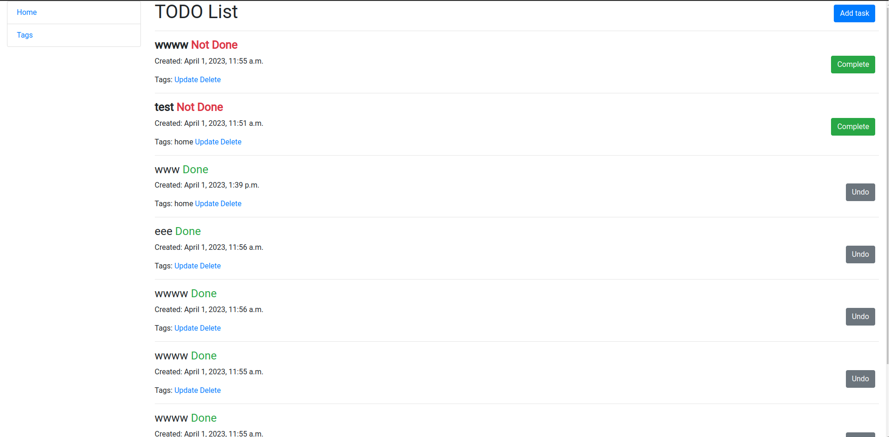
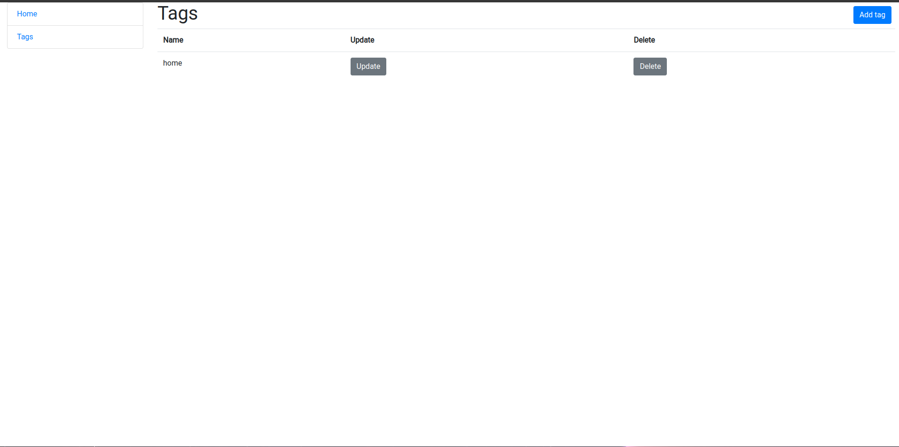
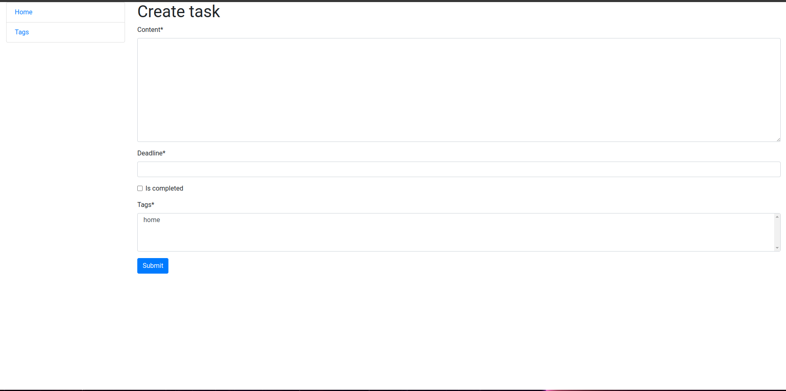

# to_do_list

TODO manager that involves task management for You: creating, updating, and deleting tasks.
It`s your personal manager like.

## Features
* User has access to create, update, and delete tasks.
* You can mark tasks as completed or not completed.
* You can also add tags to your tasks, for example (home, work, meetings).







## Installation

Python3 must be already installed

```shell
git clone https://github.com/evgenijmartynuk07/to_do_list
cd todo_list
python -m venv venv
Windows: venv\Scripts\activate
Linux, Unix: source venv/bin/activate
pip install -r requirements.txt
python manage.py runserver
```